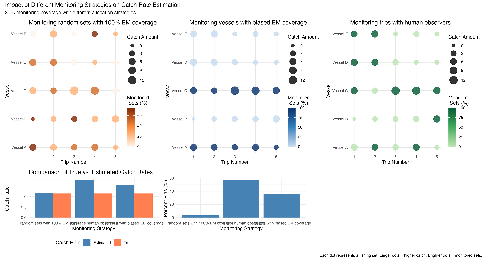
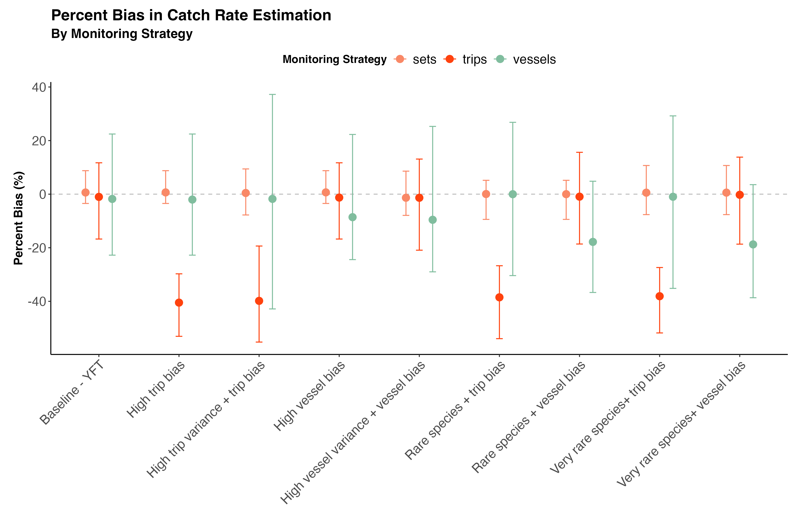

--- 
title: "Impact of sampling bias on catch rate estimation"
author: "CJ Brown (c.j.brown@utas.edu.au)"
date: "`r Sys.Date()`"
description: |
  Analysis of catch rate estimation with biased sampling strategies
bibliography: references.bib
output: word_document  
---

## What This Study Is About

The Marine Stewardship Council (MSC) requires fishing fleets to monitor 30% of their fishing activities to track statistics like market species catch rate and bycatch. However, they haven't specified exactly how that 30% should be chosen. This creates a potential problem: fishing companies might choose to monitor only their "best" 30% of vessels or trips - those with the lowest bycatch rates - making their overall performance look better than it actually is.

This study investigated whether different ways of selecting which fishing activities to monitor would give accurate estimates of true catch rates, or if some methods would be biased and misleading.

## The Research Question

**Main Question:** How do different strategies for monitoring 30% of fishing activities affect the accuracy of estimated catch rates?

**Why This Matters:** If monitoring is biased toward "cleaner" vessels or trips, regulators and the public might think a fishery is performing better than it really is, potentially allowing harmful fishing practices to continue undetected.

## How The Study Was Done

We created a computer simulation that modeled a realistic fishing fleet with:

- Multiple fishing vessels
- Different numbers of fishing trips per vessel per year
- Different numbers of fishing sets (individual fishing operations) per trip
- Natural variation in catch rates between vessels, trips, and individual fishing sets

The simulation was set-up to be representative of a Pacific long-line tuna fleet. 

They then tested three different monitoring strategies:

1. **Random Set Monitoring:** Randomly selecting 30% of all individual fishing operations across the entire fleet
2. **Vessel-Based Monitoring:** Selecting 30% of vessels and monitoring all their activities. This happens when  electronic monitoring systems are installed on a fraction of a fleet's vessels. 
3. **Trip-Based Monitoring:** Selecting 30% of fishing trips and monitoring all activities on those trips. This is what happens with human observers. 

For strategies 2 and 3, we also tested what happens when there's bias - meaning there was preferential selection vessels or trips with lower catch rates for monitoring.

The simulation was run for several different scenarios 

### Simulation Scenarios

We tested the following scenarios to represent different real-world conditions fishing fleets might encounter:

| Scenario | Description | Key Parameters |
|----------|-------------|----------------|
| 1. Baseline | Typical conditions for yellowfin tuna fisheries with normal variation between vessels and trips | Standard variance (σₓ=0.41, σᵣ=0.67), no bias |
| 2. High Vessel Bias | Monitoring preferentially applied to vessels with lower catch rates | Vessel bias=-2, no trip bias |
| 3. High Trip Bias | Monitoring preferentially applied to trips with lower catch rates | Trip bias=-2, no vessel bias | 
| 4. High Vessel Variance with Bias | Combines vessel selection bias with higher natural variation between vessels | Increased vessel variance (σᵣ=0.9), vessel bias=-2 |
| 5. High Trip Variance with Bias | Combines trip selection bias with higher natural variation between trips | Increased trip variance (σₓ=0.8), trip bias=-2 |
| 6. Rare Species with Vessel Bias | Bycatch of uncommon species like sharks with biased vessel selection | Lower catch rate (β₀=0.08), vessel bias=-2 |
| 7. Very Rare Species with Vessel Bias | Extremely rare bycatch events e.g. turtles with biased vessel selection | Very low catch rate (β₀=0.008), vessel bias=-2 |
| 8. Rare Species with Trip Bias | Uncommon species bycatch with biased trip selection | Lower catch rate (β₀=0.08), trip bias=-2 |
| 9. Very Rare Species with Trip Bias | Extremely rare bycatch events with biased trip selection | Very low catch rate (β₀=0.008), trip bias=-2 |

### The Conceptual Framework
The conceptual figure illustrates how different monitoring approaches work. It shows a fishing fleet where  dots represent different vessels and their fishing activities. Orange dots are monitored, grey dots are not monitored. The three sampling strategies are shown, demonstrating how monitoring coverage varies depending on the strategy used.

## Key Findings

### Main Results

This figures shows the per cent bias for each scenario and monitoring strategy (means and 95% confidence intervals). 

The key take-home here is that biasing towards the lowest catch trips caused the biggest under-estimation of catch rates.

When fishing sets were chosen completely randomly across the fleet, the estimated catch rates were very close to the true catch rates. They also had greater certainty (tighter intervals).  This approach showed minimal bias regardless of how the fleet was structured

When monitoring was selecting whole vessels the uncertainty in catch rates was much greater. Bias towards low catch rate vessels also caused under-estimation of catch rates, particularly for rare species [CB: need to check this result, possibly a bug here, vessel effect intervals not as strong as I expected]

## What This Means in Practice

**For Fisheries Management:**
The current MSC requirement of "30% monitoring" is insufficient without specifying how that 30% should be selected. Random selection across all fishing operations provides the most accurate estimates. This requires 100% EM or human coverage on vessels.

Allowing companies to choose which vessels or trips to monitor creates opportunities for gaming the system

**For Consumers and Environmental Groups:**
Fisheries certified under current MSC standards might not be as sustainable as they appear if monitoring is biased. More specific requirements for random monitoring could improve the reliability of sustainability certifications

**For the Fishing Industry:**
While random monitoring might reveal higher bycatch rates initially, it provides a more honest baseline for improvement. It will be harder for companies to understand their fleets and fishing practices if EM allocation is biased to some vessels. 

## Bottom Line

This study demonstrates that **how** you monitor fishing activities is just as important as **how much** you monitor. Simply requiring 30% coverage isn't enough - the selection method matters enormously. Random selection across all fishing operations provides accurate estimates, while allowing strategic selection of "better" vessels or trips can severely bias results and undermine the goals of sustainable fisheries management.

The research provides clear evidence that monitoring standards should specify not just coverage levels, but also require random selection to prevent gaming and ensure accurate assessment of fishing impacts.