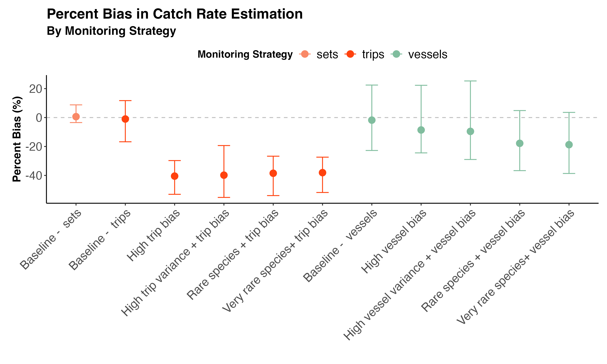

--- 
title: "Impact of sampling bias on catch rate estimation"
author: "CJ Brown (c.j.brown@utas.edu.au); The Nature Conservancy"
date: "`r Sys.Date()`"
description: |
  Analysis of catch rate estimation with biased sampling strategies
bibliography: references.bib
output: word_document  
---

## The problem

The Marine Stewardship Council (MSC) requires fishing fleets to monitor 30% of their fishing activities to track statistics like market species catch rate and bycatch. However, they haven't specified exactly how that 30% should be chosen. This creates a potential problem: fishing companies might choose to monitor only their "best" 30% of vessels or trips - those with the lowest bycatch rates - making their overall performance look better than it actually is.

This study investigated whether different ways of selecting which fishing activities to monitor would give accurate estimates of true catch rates, or if some methods would be biased and misleading.

Here we provide narratives for how different strategies for monitoring 30% of fishing activities affect the accuracy of estimated catch rates?

**Why This Matters:** If monitoring is biased toward "cleaner" vessels or trips, regulators and the public might think a fishery is performing better than it really is, potentially allowing harmful fishing practices to continue undetected.

## How The Study Was Done

We created a computer simulation that modeled a realistic fishing fleet with:

- Multiple fishing vessels
- Different numbers of fishing trips per vessel per year
- Different numbers of fishing sets (individual fishing operations) per trip
- Natural variation in catch rates between vessels, trips, and individual fishing sets

The simulation was set-up to be representative of a Pacific long-line tuna fleet (based on results in @brown2021electronic). 

We then implemented different monitoring strategies for several different example scenarios. 

### Conceptual Framework
This conceptual figure illustrates how different monitoring approaches work. It shows a fishing fleet where  dots represent different vessels and their fishing activities. Orange dots are monitored, grey dots are not monitored. The three sampling strategies are shown, demonstrating how monitoring coverage varies depending on the strategy used.

If monitoring is done randomlyl we get an estimate of the catch rate that is representative of the true catch rate. If monitoring is done by whole vessels or whole trips, and the selection of those units is biased towards lower catch rates, then the estimated catch rates will also be biased. 

## Scenarios 

We describe scenarios below. This plot shows the percentage bias in estimated catch rates for each scenario and monitoring strategy. Points show mean bias across 1000 simulations and error bars show 95% confidence intervals.

### Scenario 1: Randomized monitoring of sets 

This is the ideal scenario for 30% distribution of monitoring across sets. We randomly selected 30% of all individual sets for monitoring. This results in no bias on average and high precision. 

Practically, this strategy can be achieved with 100% electronic monitoring (EM) coverage. The review team then reviews a subset of the footage, selecting sets at random. 

### Scenario 2: Randomized monitoring of trips

This scenario involves randomly selecting 30% of fishing trips for monitoring. All sets within the selected trips are monitored. This results in no bias on average but lower precision compared to randomized monitoring of sets due to the clustering of data within trips.

Practically, this strategy can be achieved with human observers assigned randomly to trips. It assumes unbiased allocation of observers across the fleet.

### Scenario 3: Randomized monitoring of vessels

In this scenario, 30% of vessels are randomly selected for monitoring, and all trips and sets within those vessels are monitored. This results in no bias on average but has the lowest precision among the three randomized strategies due to the clustering of data within vessels.

Practically, this strategy can be achieved by installing electronic monitoring systems on a random subset of vessels.

### Scenario 4: Monitoring trips with high trip bias

This scenario assumes that monitoring is biased toward trips with lower catch rates. This results in significant underestimation of catch rates and reduced precision.

Practically, this bias could occur if human observers are preferentially assigned to trips perceived as "cleaner" or less risky.

### Scenario 5: Monitoring trips with high trip variance and bias

This scenario combines high natural variation in catch rates between trips with biased monitoring toward trips with lower catch rates. This results in severe underestimation of catch rates and increased uncertainty.

This could occur in fisheries with high differences in catch rates across fleets, such as when there are significant seasonal changes in catch. It could also occur when vessel captians change trip plans if they know they are being monitored, such as making shorter trips when observers are assigned.

### Scenario 6: Monitoring vessels with high vessel bias

This scenario assumes that monitoring is biased toward vessels with lower catch rates. This results in significant underestimation of catch rates and reduced precision.

This bias could occur if electronic monitoring systems are preferentially installed on vessels perceived as "cleaner" [e.g. @roberson2025opportunity]. This practice has been common in other certification schemes (such as ASC and FSC) where companies choose a subset of their best operations and then apply for certification for those. 

### Scenario 7: Monitoring vessels with high vessel variance and bias

This scenario combines high natural variation in catch rates between vessels with biased monitoring toward vessels with lower catch rates. This results in severe underestimation of catch rates and increased uncertainty.

Practically, this could occur in fleets with highly variable vessel performance or differences in fishing practices. Monitoring is then biased towards those that are cleaner. 

### Scenario 8: Monitoring trips for rare species with trip bias

This is similar to above, but for a rare species. This results in significant underestimation of rare species catch rates.

### Scenario 9: Monitoring vessels for rare species with vessel bias

This is similar to above, but for a rare species. This results in significant underestimation of rare species catch rates.

### Scenario 10: Monitoring trips for very rare species with trip bias

This is similar to above, but is relevant for a very rare species or a rare compliance event. This results in severe underestimation of very rare species catch rates, or underestimation of the occurrence of compliance events. 

Practically, this bias could occur if human observers are preferentially assigned to trips perceived as less risky for very rare species bycatch.

### Scenario 11: Monitoring vessels for very rare species with vessel bias

This is similar to above, but is relevant for a very rare species or a rare compliance event. This results in severe underestimation of very rare species catch rates.

Practically, this bias could occur if electronic monitoring systems are preferentially installed on vessels perceived as less risky for very rare species bycatch.

## Key Findings

The key take-home here is that biasing towards the lowest catch trips caused the biggest under-estimation of catch rates.

When fishing sets were chosen completely randomly across the fleet, the estimated catch rates were very close to the true catch rates. They also had greater certainty (tighter intervals).  This approach showed minimal bias regardless of how the fleet was structured

When monitoring was selecting whole vessels the uncertainty in catch rates was much greater. This means less certainty in what true catch rates will be. Bias towards low catch rate vessels also caused under-estimation of catch rates, particularly for rare species. 

## What This Means in Practice

**For Fisheries Management:**
The current MSC requirement of "30% monitoring" is insufficient without specifying how that 30% should be selected. Random selection across all fishing operations provides the most accurate estimates. This requires 100% EM or human coverage on vessels.

Allowing companies to choose which vessels or trips to monitor, or to alter practices if they know they are being monitored, creates opportunities for gaming the system

**For Consumers and Environmental Groups:**
Fisheries certified under current MSC standards might not be as sustainable as they appear if monitoring is biased. More specific requirements for random monitoring could improve the reliability of sustainability certifications

**For the Fishing Industry:**
While random monitoring might reveal higher bycatch rates initially, it provides a more honest baseline for improvement. It will be harder for companies to understand their fleets and fishing practices if EM allocation is biased to some vessels. 

## Conclusion 

We need more specific instructions than simply requiring 30% coverage. The selection of the 30% matters enormously. Random selection across all fishing operations provides accurate estimates, while allowing strategic selection of "better" vessels or trips can severely bias results and undermine the goals of sustainable fisheries management.

## Technical annex 

## References

