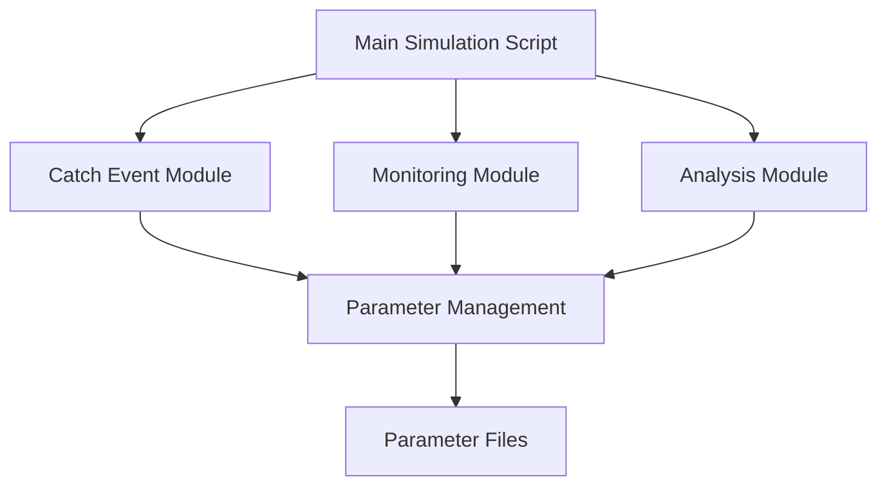
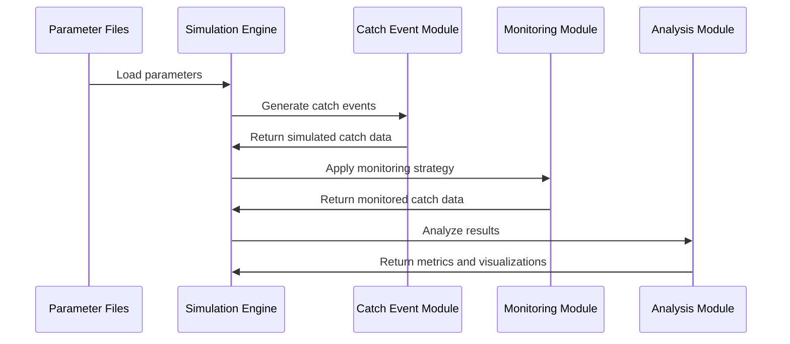
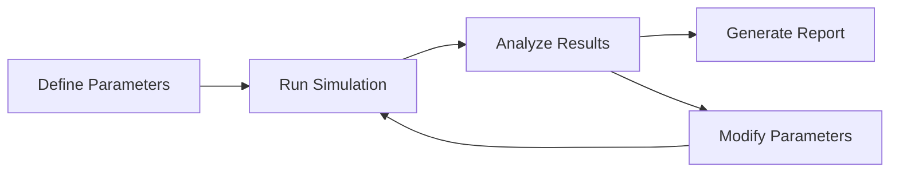

# MSC Monitoring Simulation Model: Implementation Plan

## 1. Code Architecture Design

Based on the project requirements and mathematical formulation, I propose the following modular architecture for the MSC monitoring simulation model:



### 1.1 Script Organization

The implementation will consist of three main R scripts:

1. **`simulation_engine.R`**: Core simulation functions
   - Main simulation function that orchestrates the entire process
   - Data generation functions for catch events
   - Implementation of monitoring strategies
   - Helper functions for random effect generation

2. **`parameter_management.R`**: Parameter handling and validation
   - Parameter loading and validation functions
   - Default parameter sets
   - Parameter documentation
   - Parameter file I/O functions

3. **`analysis_visualization.R`**: Analysis and visualization
   - Functions to calculate metrics (bias, detection rates)
   - Visualization functions for different output types
   - Summary statistics functions
   - Report generation helpers

### 1.2 Data Flow



### 1.3 Modular Structure

The implementation will follow these principles:

- **Separation of Concerns**: Clear separation between data generation, monitoring simulation, and analysis
- **Encapsulation**: Each module handles its own internal logic
- **Dependency Injection**: Parameters are passed to functions rather than using global variables
- **Functional Programming**: Pure functions with minimal side effects
- **Testability**: Functions designed to be easily tested in isolation

## 2. User-Friendly Parameter Specification System

### 2.1 Parameter File Structure

Parameters will be organized in JSON files with the following structure:

```json
{
  "simulation_parameters": {
    "n_simulations": 1000,
    "seed": 12345,
    "fleet_size": {
      "vessels": 100,
      "trips_per_vessel": 10,
      "sets_per_trip": 5
    }
  },
  "catch_model_parameters": {
    "species": [
      {
        "name": "Common Species",
        "distribution": "poisson",
        "beta0": 2.5,
        "sigma2_vessel": 0.3,
        "sigma2_trip": 0.2,
        "sigma2_residual": 0.1
      },
      {
        "name": "Rare Species",
        "distribution": "negative_binomial",
        "beta0": 0.5,
        "sigma2_vessel": 0.4,
        "sigma2_trip": 0.3,
        "sigma2_residual": 0.2,
        "phi": 1.5
      }
    ]
  },
  "monitoring_parameters": {
    "coverage_percentage": 30,
    "strategy": "random_sets",
    "bias_parameters": {
      "delta_monitoring": 0.0,
      "gamma_selection": 0.0
    }
  }
}
```

### 2.2 Parameter Validation System

The parameter management module will include:

1. **Schema Validation**: Ensure all required parameters are present and have correct types
2. **Range Validation**: Check that parameters are within valid ranges
3. **Consistency Checks**: Verify that interdependent parameters are consistent
4. **Default Values**: Provide sensible defaults for optional parameters
5. **Error Messages**: Clear error messages for invalid parameters

### 2.3 Default Parameter Sets

The implementation will include 3-6 default parameter sets representing different realistic scenarios:

1. **Baseline Scenario**: Neutral parameters with no bias
2. **High Vessel Variability**: Increased vessel-level variance
3. **High Trip Variability**: Increased trip-level variance
4. **Biased Monitoring**: Positive delta_monitoring (bias toward vessels with higher catch rates)
5. **Rare Event Scenario**: Focus on very rare species with binomial/zero-inflated distributions

### 2.4 Parameter Documentation

Each parameter will be thoroughly documented with:

- Description of the parameter
- Units and range of valid values
- Default value and justification
- References to literature for parameter values
- Examples of how changing the parameter affects the simulation

## 3. Core Function Specifications

### 3.1 Main Simulation Function

```r
run_simulation <- function(
  parameter_file = NULL,
  parameters = NULL,
  n_simulations = 1000,
  return_raw_data = FALSE,
  verbose = TRUE
) {
  # Returns a list containing:
  # - summary_metrics: Data frame with bias and detection metrics
  # - plots: List of ggplot objects
  # - raw_data: (optional) Raw simulation data
}
```

### 3.2 Catch Event Generation Functions

```r
generate_fleet <- function(
  n_vessels,
  n_trips_per_vessel,
  n_sets_per_trip,
  company_structure = NULL
) {
  # Returns a nested list representing the fleet structure
}

generate_random_effects <- function(
  fleet,
  species_parameters
) {
  # Returns a list of random effects for each hierarchical level
}

generate_catch_data <- function(
  fleet,
  random_effects,
  species_parameters
) {
  # Returns a data frame with simulated catch data
}
```

### 3.3 Monitoring Strategy Functions

```r
apply_monitoring_strategy <- function(
  catch_data,
  strategy,
  coverage_percentage,
  bias_parameters = NULL
) {
  # Returns a data frame with monitoring status for each set
}

monitor_random_sets <- function(
  catch_data,
  coverage_percentage,
  bias_parameters = NULL
) {
  # Implementation of random sets monitoring strategy
}

monitor_random_vessels <- function(
  catch_data,
  coverage_percentage,
  bias_parameters = NULL
) {
  # Implementation of random vessels monitoring strategy
}

monitor_random_trips <- function(
  catch_data,
  coverage_percentage,
  bias_parameters = NULL
) {
  # Implementation of random trips monitoring strategy
}
```

### 3.4 Analysis and Summary Functions

```r
calculate_metrics <- function(
  true_catch_data,
  monitored_catch_data
) {
  # Returns metrics comparing true vs. estimated catch rates
}

summarize_results <- function(
  simulation_results,
  grouping_variables = c("strategy", "species")
) {
  # Returns summary statistics across simulation runs
}

plot_results <- function(
  summary_results,
  plot_type = c("bar", "boxplot", "density")
) {
  # Returns ggplot visualization
}
```

### 3.5 Input/Output Specifications

```r
load_parameters <- function(
  parameter_file,
  validate = TRUE
) {
  # Returns validated parameter list
}

save_results <- function(
  simulation_results,
  output_file,
  format = c("rds", "csv", "json")
) {
  # Saves results to file
}

generate_report <- function(
  simulation_results,
  output_file,
  template = "default"
) {
  # Generates R Markdown report
}
```

## 4. Implementation Phases

### 4.1 Phase 1: Core Simulation Engine (Weeks 1-2)

**Deliverables:**
- Basic fleet structure generation
- Random effects generation for hierarchical levels
- Catch data simulation for different distributions
- Simple implementation of monitoring strategies
- Basic metrics calculation

**Tasks:**
1. Implement fleet structure generation
2. Implement random effects generation
3. Implement catch data simulation for Poisson distribution
4. Implement basic monitoring strategies
5. Implement basic metrics calculation
6. Write unit tests for core functions

### 4.2 Phase 2: Parameter Management System (Weeks 3-4)

**Deliverables:**
- Parameter file structure definition
- Parameter validation system
- Default parameter sets
- Parameter documentation
- Parameter file I/O functions

**Tasks:**
1. Define parameter file structure
2. Implement parameter validation
3. Create default parameter sets
4. Write parameter documentation
5. Implement parameter file I/O functions
6. Write unit tests for parameter management

### 4.3 Phase 3: Analysis and Visualization (Weeks 5-6)

**Deliverables:**
- Comprehensive metrics calculation
- Visualization functions for different output types
- Summary statistics functions
- Report generation templates
- Example analyses for default parameter sets

**Tasks:**
1. Implement comprehensive metrics calculation
2. Create visualization functions
3. Implement summary statistics functions
4. Create report generation templates
5. Run example analyses
6. Write unit tests for analysis functions

### 4.4 Phase 4: Integration and Testing (Weeks 7-8)

**Deliverables:**
- Integrated simulation pipeline
- Comprehensive test suite
- Performance optimization
- Documentation and examples
- Final parameter sets with narratives

**Tasks:**
1. Integrate all components
2. Write integration tests
3. Optimize performance for large fleets
4. Complete documentation
5. Finalize parameter sets with narratives
6. Create example reports

## 5. Technical Requirements

### 5.1 R Package Dependencies

The implementation will rely on the following R packages:

- **Core Packages**:
  - `stats`: For random number generation and distributions
  - `dplyr`, `tidyr`, `purrr`: For data manipulation
  - `ggplot2`: For visualization
  - `jsonlite`: For parameter file handling

- **Optional Packages**:
  - `lme4`: For fitting mixed-effects models to simulated data
  - `parallel`: For parallel processing of simulations
  - `rmarkdown`: For report generation
  - `testthat`: For unit testing

### 5.2 Data Structures

#### Fleet Structure

```r
fleet <- list(
  vessels = list(
    vessel_1 = list(
      trips = list(
        trip_1 = list(
          sets = list(1, 2, 3, 4, 5)
        ),
        trip_2 = list(
          sets = list(1, 2, 3, 4, 5)
        )
      ),
      company = "company_1"
    ),
    vessel_2 = ...
  )
)
```

#### Catch Data

```r
catch_data <- data.frame(
  vessel_id = character(),
  trip_id = character(),
  set_id = integer(),
  species = character(),
  count = integer(),
  monitored = logical()
)
```

#### Random Effects

```r
random_effects <- list(
  vessel = list(
    species_1 = numeric(),
    species_2 = numeric()
  ),
  trip = list(
    species_1 = numeric(),
    species_2 = numeric()
  ),
  residual = list(
    species_1 = numeric(),
    species_2 = numeric()
  )
)
```

### 5.3 Performance Considerations

For realistic fleet sizes:

- **Memory Management**: Use efficient data structures
- **Vectorization**: Avoid loops where possible
- **Parallel Processing**: Option for parallel simulation runs
- **Progress Reporting**: Provide feedback during long simulations
- **Incremental Computation**: Option to save intermediate results

### 5.4 Error Handling and Validation

- **Input Validation**: Validate all function inputs
- **Informative Error Messages**: Clear error messages with suggestions
- **Warnings**: Use warnings for non-critical issues
- **Logging**: Option for detailed logging
- **Graceful Degradation**: Fallback options when optimal approach fails

## 6. Implementation Guidelines

### 6.1 Coding Style

- Follow the [tidyverse style guide](https://style.tidyverse.org/)
- Use consistent naming conventions
- Document all functions with roxygen2-style comments
- Keep functions focused on a single responsibility
- Limit function length to improve readability

### 6.2 Testing Strategy

- Unit tests for all core functions
- Integration tests for the simulation pipeline
- Parameter validation tests
- Performance tests for large fleets
- Edge case tests for rare events

### 6.3 Documentation

- README with overview and quick start
- Vignettes for common use cases
- Function documentation
- Parameter documentation
- Example scripts

### 6.4 Version Control

- Use Git for version control
- Semantic versioning for releases
- Branch for features and bug fixes
- Pull requests for code review

## 7. Example Workflow



A typical workflow would involve:

1. **Define Parameters**: Create or modify a parameter file
2. **Run Simulation**: Execute the simulation with the parameters
3. **Analyze Results**: Calculate metrics and visualize results
4. **Generate Report**: Create a report with findings
5. **Modify Parameters**: Adjust parameters based on results
6. **Iterate**: Run additional simulations with modified parameters

## 8. Conclusion

This implementation plan provides a comprehensive roadmap for developing the MSC monitoring simulation model. The modular design ensures flexibility and maintainability, while the parameter specification system allows for easy experimentation with different scenarios. The phased implementation approach enables incremental development and testing, with clear deliverables for each phase.

The final product will be a powerful tool for evaluating different monitoring strategies and their impact on estimated catch rates and compliance detection. The results will provide valuable insights for the Marine Stewardship Council in determining optimal monitoring approaches for fishing fleets.